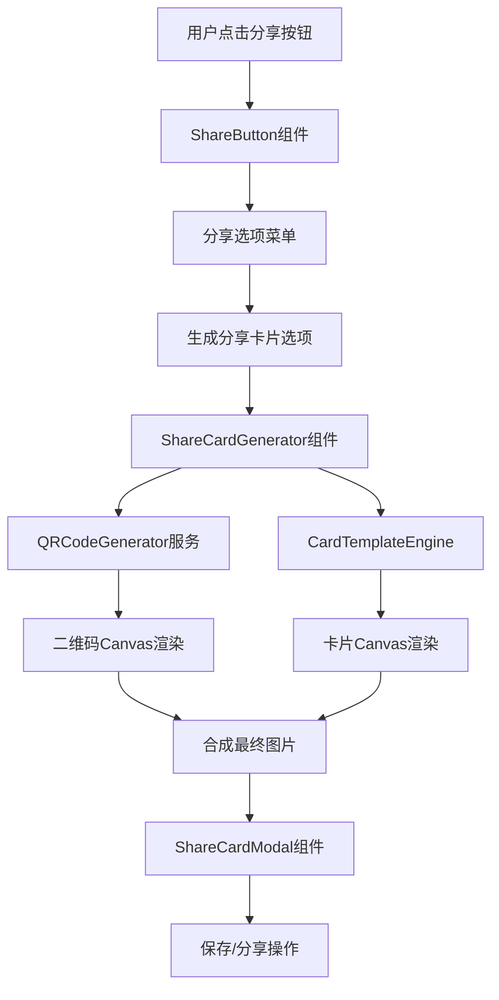

# Design Document

## Overview

音频分享二维码卡片功能将在现有的 ShareButton 组件基础上，增加生成精美图片卡片的能力。该功能使用 HTML5 Canvas API 在客户端生成包含音频信息和二维码的高质量图片，用户可以保存或直接分享这些卡片。

## Architecture

### 系统架构图



### 技术栈选择

- **Canvas API**: 用于图片生成和渲染
- **qrcode.js**: 轻量级二维码生成库
- **html2canvas**: 备用方案，用于复杂布局的图片生成
- **React Hooks**: 状态管理和生命周期控制
- **TypeScript**: 类型安全和开发体验

## Components and Interfaces

### 1. ShareCardGenerator 组件

```typescript
interface ShareCardGeneratorProps {
  audio: AudioFile;
  template?: CardTemplate;
  onGenerated: (imageBlob: Blob, imageUrl: string) => void;
  onError: (error: Error) => void;
}

interface CardTemplate {
  id: string;
  name: string;
  width: number;
  height: number;
  backgroundColor: string;
  layout: LayoutConfig;
}

interface LayoutConfig {
  title: TextConfig;
  description: TextConfig;
  qrCode: QRConfig;
  cover: ImageConfig;
  branding: BrandingConfig;
}
```

### 2. QRCodeGenerator 服务

```typescript
class QRCodeGenerator {
  static generateQRCode(
    url: string, 
    size: number, 
    options?: QROptions
  ): Promise<HTMLCanvasElement>;
  
  static generateQRCodeDataURL(
    url: string, 
    size: number, 
    options?: QROptions
  ): Promise<string>;
}

interface QROptions {
  errorCorrectionLevel: 'L' | 'M' | 'Q' | 'H';
  margin: number;
  color: {
    dark: string;
    light: string;
  };
}
```

### 3. CardTemplateEngine 类

```typescript
class CardTemplateEngine {
  private canvas: HTMLCanvasElement;
  private ctx: CanvasRenderingContext2D;
  
  constructor(template: CardTemplate);
  
  async renderCard(audio: AudioFile, qrCodeCanvas: HTMLCanvasElement): Promise<Blob>;
  
  private drawBackground(): void;
  private drawTitle(text: string, config: TextConfig): void;
  private drawDescription(text: string, config: TextConfig): void;
  private drawCoverImage(imageUrl: string, config: ImageConfig): Promise<void>;
  private drawQRCode(qrCanvas: HTMLCanvasElement, config: QRConfig): void;
  private drawBranding(config: BrandingConfig): void;
}
```

### 4. ShareCardModal 组件

```typescript
interface ShareCardModalProps {
  isOpen: boolean;
  imageUrl: string;
  imageBlob: Blob;
  audioTitle: string;
  onClose: () => void;
  onSave: () => void;
  onShare: () => void;
}
```

## Data Models

### 卡片模板数据结构

```typescript
interface CardTemplate {
  id: string;
  name: string;
  width: number; // 推荐 1080px
  height: number; // 推荐 1080px
  backgroundColor: string;
  backgroundImage?: string;
  layout: {
    title: {
      x: number;
      y: number;
      width: number;
      height: number;
      fontSize: number;
      fontFamily: string;
      color: string;
      align: 'left' | 'center' | 'right';
      maxLines: number;
    };
    description: {
      x: number;
      y: number;
      width: number;
      height: number;
      fontSize: number;
      fontFamily: string;
      color: string;
      align: 'left' | 'center' | 'right';
      maxLines: number;
    };
    cover: {
      x: number;
      y: number;
      width: number;
      height: number;
      borderRadius: number;
      placeholder: string; // 默认封面图片
    };
    qrCode: {
      x: number;
      y: number;
      size: number;
      backgroundColor: string;
      padding: number;
    };
    branding: {
      logo: {
        x: number;
        y: number;
        width: number;
        height: number;
      };
      text: {
        x: number;
        y: number;
        fontSize: number;
        color: string;
        text: string;
      };
    };
    metadata: {
      duration: {
        x: number;
        y: number;
        fontSize: number;
        color: string;
      };
      category: {
        x: number;
        y: number;
        fontSize: number;
        color: string;
      };
    };
  };
}
```

### 预设模板

1. **经典模板**: 简洁的白色背景，左侧音频信息，右侧二维码
2. **现代模板**: 渐变背景，居中布局，圆形二维码
3. **医学专业模板**: 医学主题色彩，专业图标装饰
4. **简约模板**: 极简设计，只包含核心信息

## Error Handling

### 错误类型定义

```typescript
enum ShareCardError {
  CANVAS_NOT_SUPPORTED = 'CANVAS_NOT_SUPPORTED',
  QR_GENERATION_FAILED = 'QR_GENERATION_FAILED',
  IMAGE_LOAD_FAILED = 'IMAGE_LOAD_FAILED',
  CARD_GENERATION_FAILED = 'CARD_GENERATION_FAILED',
  SAVE_FAILED = 'SAVE_FAILED',
  SHARE_FAILED = 'SHARE_FAILED'
}

class ShareCardErrorHandler {
  static handle(error: ShareCardError, context?: any): void;
  static getErrorMessage(error: ShareCardError): string;
  static showUserFriendlyError(error: ShareCardError): void;
}
```

### 错误处理策略

1. **Canvas 不支持**: 降级到简单的链接分享
2. **二维码生成失败**: 使用在线二维码服务作为备用
3. **图片加载失败**: 使用默认占位符图片
4. **卡片生成失败**: 提供重试机制，最多3次
5. **保存失败**: 提供复制图片数据的备用方案
6. **分享失败**: 降级到复制链接

## Testing Strategy

### 单元测试

1. **QRCodeGenerator 测试**
   - 测试不同URL长度的二维码生成
   - 测试不同尺寸和选项的二维码
   - 测试错误处理

2. **CardTemplateEngine 测试**
   - 测试各种模板的渲染
   - 测试文本换行和截断
   - 测试图片加载和缩放

3. **ShareCardGenerator 测试**
   - 测试完整的卡片生成流程
   - 测试不同音频数据的处理
   - 测试异步操作和错误处理

### 集成测试

1. **端到端分享流程测试**
   - 从点击分享按钮到保存图片的完整流程
   - 测试不同设备和浏览器的兼容性
   - 测试网络异常情况的处理

2. **性能测试**
   - 测试大量并发生成请求的处理
   - 测试内存使用和清理
   - 测试生成速度优化

### 用户体验测试

1. **可用性测试**
   - 测试用户操作流程的直观性
   - 测试错误提示的友好性
   - 测试加载状态的反馈

2. **视觉测试**
   - 测试不同模板的视觉效果
   - 测试不同屏幕尺寸的适配
   - 测试生成图片的质量

## Performance Considerations

### 优化策略

1. **Canvas 复用**: 创建 Canvas 池，避免频繁创建销毁
2. **图片缓存**: 缓存常用的封面图片和品牌资源
3. **异步处理**: 使用 Web Workers 进行重计算任务
4. **内存管理**: 及时清理 Canvas 和 Blob 对象
5. **懒加载**: 按需加载二维码生成库

### 性能指标

- 卡片生成时间: < 3秒
- 内存使用: < 50MB
- 并发处理: 支持10个同时生成请求
- 图片质量: 1080x1080, 高清无损

## Security Considerations

1. **URL 验证**: 确保二维码中的URL是合法的应用内链接
2. **XSS 防护**: 对用户输入的音频标题和描述进行转义
3. **资源限制**: 限制生成频率，防止滥用
4. **隐私保护**: 不在客户端存储敏感信息

## Implementation Plan

### Phase 1: 核心功能开发
- 实现 QRCodeGenerator 服务
- 实现 CardTemplateEngine 类
- 创建基础的 ShareCardGenerator 组件

### Phase 2: 用户界面开发
- 实现 ShareCardModal 组件
- 集成到现有的 ShareButton 组件
- 实现模板选择功能

### Phase 3: 优化和测试
- 性能优化和内存管理
- 错误处理和用户体验改进
- 全面测试和兼容性验证

### Phase 4: 高级功能
- 自定义模板编辑器
- 批量生成功能
- 社交媒体优化