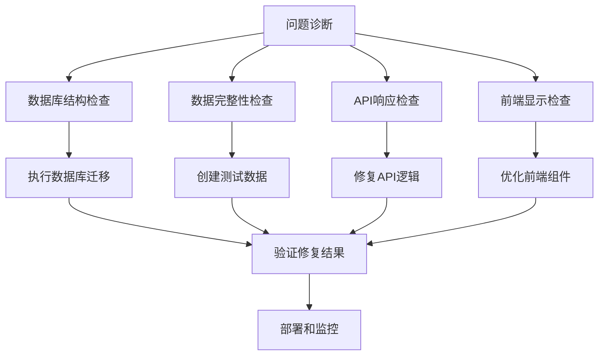

# 修复分类管理界面层级显示问题设计文档

## 概览

本设计文档详细说明如何修复 `admin/categories-db` 页面中二级分类不显示的问题。主要包括数据库结构验证、测试数据创建、前端显示逻辑修复和功能增强等方面。

## 架构

### 问题分析

当前可能存在的问题：
1. **数据库迁移未执行** - 缺少层级字段
2. **缺少测试数据** - 没有二级分类数据
3. **前端显示逻辑** - 组件未正确处理层级数据
4. **API数据格式** - 层级信息未正确传递

### 解决方案架构



## 组件和接口

### 1. 数据库结构修复

#### 数据库迁移验证
```sql
-- 检查表结构
SELECT column_name, data_type, is_nullable, column_default
FROM information_schema.columns 
WHERE table_name = 'categories' 
AND column_name IN ('parent_id', 'level', 'sort_order')
ORDER BY ordinal_position;

-- 检查约束
SELECT constraint_name, constraint_type
FROM information_schema.table_constraints
WHERE table_name = 'categories'
AND constraint_type IN ('FOREIGN KEY', 'CHECK');
```

#### 迁移执行脚本
```sql
-- 如果字段不存在，执行迁移
DO $$
BEGIN
    -- 检查并添加 parent_id 字段
    IF NOT EXISTS (
        SELECT 1 FROM information_schema.columns 
        WHERE table_name = 'categories' AND column_name = 'parent_id'
    ) THEN
        ALTER TABLE categories ADD COLUMN parent_id VARCHAR(255) DEFAULT NULL;
    END IF;
    
    -- 检查并添加 level 字段
    IF NOT EXISTS (
        SELECT 1 FROM information_schema.columns 
        WHERE table_name = 'categories' AND column_name = 'level'
    ) THEN
        ALTER TABLE categories ADD COLUMN level INTEGER DEFAULT 1 CHECK (level IN (1, 2));
    END IF;
    
    -- 检查并添加 sort_order 字段
    IF NOT EXISTS (
        SELECT 1 FROM information_schema.columns 
        WHERE table_name = 'categories' AND column_name = 'sort_order'
    ) THEN
        ALTER TABLE categories ADD COLUMN sort_order INTEGER DEFAULT 0;
    END IF;
END $$;
```

### 2. 测试数据创建

#### 二级分类数据结构
```typescript
interface TestCategoryData {
  parentId: string;
  categories: Array<{
    id: string;
    name: string;
    description: string;
    color?: string;
    icon?: string;
  }>;
}

const testSubcategories: TestCategoryData[] = [
  {
    parentId: 'cardiology', // 心血管
    categories: [
      {
        id: 'cardiology-hypertension',
        name: '高血压',
        description: '高血压诊断、治疗和管理',
        color: '#ef4444',
        icon: '💓'
      },
      {
        id: 'cardiology-arrhythmia',
        name: '心律失常',
        description: '心律失常的诊断和治疗',
        color: '#ef4444',
        icon: '💗'
      },
      {
        id: 'cardiology-heart-failure',
        name: '心力衰竭',
        description: '心力衰竭的管理和治疗',
        color: '#ef4444',
        icon: '💔'
      }
    ]
  },
  {
    parentId: 'neurology', // 神经外科
    categories: [
      {
        id: 'neurology-stroke',
        name: '脑卒中',
        description: '脑卒中的预防、诊断和治疗',
        color: '#8b5cf6',
        icon: '🧠'
      },
      {
        id: 'neurology-epilepsy',
        name: '癫痫',
        description: '癫痫的诊断和管理',
        color: '#8b5cf6',
        icon: '⚡'
      }
    ]
  }
];
```

#### 数据创建函数
```typescript
async function createTestSubcategories(): Promise<void> {
  for (const parentData of testSubcategories) {
    // 验证父分类存在
    const parentExists = await CategoryService.getCategoryById(parentData.parentId);
    if (!parentExists) {
      console.warn(`父分类不存在: ${parentData.parentId}`);
      continue;
    }

    // 创建子分类
    for (const subcategory of parentData.categories) {
      try {
        await CategoryService.createCategory({
          name: subcategory.name,
          description: subcategory.description,
          parentId: parentData.parentId,
          color: subcategory.color,
          icon: subcategory.icon
        });
        console.log(`创建子分类成功: ${subcategory.name}`);
      } catch (error) {
        console.error(`创建子分类失败: ${subcategory.name}`, error);
      }
    }
  }
}
```

### 3. 前端组件优化

#### 表格列定义增强
```typescript
const enhancedColumns = [
  {
    title: 'ID',
    dataIndex: 'id',
    key: 'id',
    width: 120,
    render: (id: string) => (
      <Text code style={{ fontSize: '12px' }}>{id}</Text>
    )
  },
  {
    title: '分类名称',
    dataIndex: 'name',
    key: 'name',
    render: (name: string, record: Category) => (
      <Space>
        {/* 层级缩进 */}
        {record.level === 2 && (
          <span style={{ marginLeft: '20px', color: '#ccc' }}>└─</span>
        )}
        
        {/* 层级标签 */}
        <Tag 
          color={record.level === 1 ? 'blue' : 'green'} 
          style={{ fontSize: '12px' }}
        >
          {record.level === 1 ? '一级' : '二级'}
        </Tag>
        
        {/* 分类名称 */}
        <span style={{ 
          fontWeight: record.level === 1 ? 'bold' : 'normal',
          fontSize: record.level === 1 ? '14px' : '13px'
        }}>
          {name}
        </span>
        
        {/* 音频数量 */}
        {record.audioCount !== undefined && record.audioCount > 0 && (
          <Tag color="orange" size="small">
            {record.audioCount} 个音频
          </Tag>
        )}
        
        {/* 状态标签 */}
        {record.isActive === false && (
          <Tag color="default" size="small">已停用</Tag>
        )}
      </Space>
    )
  },
  {
    title: '父分类',
    dataIndex: 'parentId',
    key: 'parentId',
    width: 150,
    render: (parentId: string, record: Category) => {
      if (!parentId) {
        return record.level === 1 ? (
          <Tag color="blue" size="small">根分类</Tag>
        ) : (
          <Text type="secondary">-</Text>
        );
      }
      
      const parent = categories.find(cat => cat.id === parentId);
      return parent ? (
        <Space>
          <Tag color="blue" size="small">{parent.name}</Tag>
          {parent.icon && <span>{parent.icon}</span>}
        </Space>
      ) : (
        <Text type="danger">未知父分类</Text>
      );
    }
  },
  // ... 其他列
];
```

#### 统计信息增强
```typescript
const EnhancedStatsCard: React.FC<{ categories: Category[] }> = ({ categories }) => {
  const stats = useMemo(() => {
    const level1Categories = categories.filter(c => c.level === 1);
    const level2Categories = categories.filter(c => c.level === 2);
    const activeCategories = categories.filter(c => c.isActive !== false);
    const categoriesWithAudio = categories.filter(c => (c.audioCount || 0) > 0);
    
    return {
      total: categories.length,
      level1: level1Categories.length,
      level2: level2Categories.length,
      active: activeCategories.length,
      withAudio: categoriesWithAudio.length,
      // 计算每个一级分类的子分类数量
      level1WithChildren: level1Categories.filter(cat => 
        level2Categories.some(sub => sub.parentId === cat.id)
      ).length
    };
  }, [categories]);

  return (
    <Card size="small">
      <Space size="large" wrap>
        <Statistic
          title="总分类数"
          value={stats.total}
          prefix={<DatabaseOutlined />}
        />
        <Statistic
          title="一级分类"
          value={stats.level1}
          prefix={<FolderOutlined />}
          suffix={stats.level1WithChildren > 0 ? `(${stats.level1WithChildren}个有子分类)` : ''}
        />
        <Statistic
          title="二级分类"
          value={stats.level2}
          prefix={<TagOutlined />}
          valueStyle={{ color: stats.level2 > 0 ? '#52c41a' : '#ff4d4f' }}
        />
        <Statistic
          title="激活状态"
          value={stats.active}
          valueStyle={{ color: '#1890ff' }}
        />
        <Statistic
          title="有音频分类"
          value={stats.withAudio}
          valueStyle={{ color: '#722ed1' }}
        />
      </Space>
    </Card>
  );
};
```

### 4. 分类创建功能增强

#### 创建表单组件
```typescript
const EnhancedCategoryForm: React.FC<{
  categories: Category[];
  onSubmit: (data: CreateCategoryRequest) => Promise<void>;
}> = ({ categories, onSubmit }) => {
  const [form] = Form.useForm();
  const [selectedParentId, setSelectedParentId] = useState<string | undefined>();

  // 获取一级分类选项
  const parentOptions = categories
    .filter(cat => cat.level === 1 && cat.isActive !== false)
    .map(cat => ({
      label: (
        <Space>
          {cat.icon && <span>{cat.icon}</span>}
          <span>{cat.name}</span>
        </Space>
      ),
      value: cat.id
    }));

  const handleSubmit = async (values: any) => {
    const data: CreateCategoryRequest = {
      ...values,
      parentId: selectedParentId
    };
    await onSubmit(data);
    form.resetFields();
    setSelectedParentId(undefined);
  };

  return (
    <Form form={form} layout="vertical" onFinish={handleSubmit}>
      <Form.Item
        name="name"
        label="分类名称"
        rules={[
          { required: true, message: '请输入分类名称' },
          { max: 50, message: '分类名称不能超过50个字符' }
        ]}
      >
        <Input placeholder="请输入分类名称" />
      </Form.Item>

      <Form.Item
        name="parentId"
        label="父分类"
        tooltip="选择父分类将创建二级分类，不选择则创建一级分类"
      >
        <Select
          placeholder="选择父分类（可选）"
          allowClear
          options={parentOptions}
          onChange={setSelectedParentId}
        />
      </Form.Item>

      {selectedParentId && (
        <Alert
          message="将创建二级分类"
          description={`新分类将作为 "${categories.find(c => c.id === selectedParentId)?.name}" 的子分类`}
          type="info"
          showIcon
          style={{ marginBottom: 16 }}
        />
      )}

      <Form.Item
        name="description"
        label="分类描述"
        rules={[{ max: 200, message: '描述不能超过200个字符' }]}
      >
        <TextArea
          rows={3}
          placeholder="请输入分类描述（可选）"
          showCount
          maxLength={200}
        />
      </Form.Item>

      <Form.Item
        name="color"
        label="分类颜色"
        tooltip="用于在界面中区分不同分类"
      >
        <Input
          type="color"
          placeholder="#6b7280"
          style={{ width: 100 }}
        />
      </Form.Item>

      <Form.Item
        name="icon"
        label="分类图标"
        tooltip="可以使用emoji或简短文字"
      >
        <Input
          placeholder="📂"
          maxLength={10}
          style={{ width: 100 }}
        />
      </Form.Item>

      <Form.Item style={{ marginBottom: 0, textAlign: 'right' }}>
        <Space>
          <Button onClick={() => form.resetFields()}>
            重置
          </Button>
          <Button type="primary" htmlType="submit">
            创建分类
          </Button>
        </Space>
      </Form.Item>
    </Form>
  );
};
```

## 数据模型

### 增强的分类数据模型
```typescript
interface EnhancedCategory extends Category {
  // 计算属性
  hasChildren?: boolean;
  childrenCount?: number;
  parentName?: string;
  fullPath?: string;
  depth?: number;
  
  // 显示属性
  displayName?: string;
  displayIcon?: string;
  displayColor?: string;
}

// 数据处理函数
function enhanceCategoryData(categories: Category[]): EnhancedCategory[] {
  return categories.map(category => {
    const enhanced: EnhancedCategory = { ...category };
    
    // 计算子分类数量
    if (category.level === 1) {
      enhanced.childrenCount = categories.filter(c => c.parentId === category.id).length;
      enhanced.hasChildren = enhanced.childrenCount > 0;
    }
    
    // 获取父分类名称
    if (category.parentId) {
      const parent = categories.find(c => c.id === category.parentId);
      enhanced.parentName = parent?.name;
      enhanced.fullPath = parent ? `${parent.name} > ${category.name}` : category.name;
    } else {
      enhanced.fullPath = category.name;
    }
    
    // 设置深度
    enhanced.depth = category.level || 1;
    
    return enhanced;
  });
}
```

## 错误处理

### 数据验证和错误处理
```typescript
class CategoryHierarchyValidator {
  static async validateDatabaseStructure(): Promise<ValidationResult> {
    try {
      // 检查必要字段是否存在
      const requiredFields = ['parent_id', 'level', 'sort_order'];
      const missingFields = [];
      
      for (const field of requiredFields) {
        const exists = await this.checkFieldExists('categories', field);
        if (!exists) {
          missingFields.push(field);
        }
      }
      
      if (missingFields.length > 0) {
        return {
          isValid: false,
          errors: [`缺少必要字段: ${missingFields.join(', ')}`],
          suggestions: ['执行数据库迁移脚本']
        };
      }
      
      return { isValid: true, errors: [] };
    } catch (error) {
      return {
        isValid: false,
        errors: ['数据库结构检查失败'],
        suggestions: ['检查数据库连接']
      };
    }
  }
  
  static async validateHierarchyConsistency(categories: Category[]): Promise<ValidationResult> {
    const errors: string[] = [];
    const suggestions: string[] = [];
    
    // 检查层级一致性
    for (const category of categories) {
      if (category.level === 1 && category.parentId) {
        errors.push(`一级分类 "${category.name}" 不应该有父分类`);
        suggestions.push(`修复分类 ${category.id} 的层级设置`);
      }
      
      if (category.level === 2 && !category.parentId) {
        errors.push(`二级分类 "${category.name}" 必须有父分类`);
        suggestions.push(`为分类 ${category.id} 设置父分类`);
      }
      
      if (category.parentId) {
        const parent = categories.find(c => c.id === category.parentId);
        if (!parent) {
          errors.push(`分类 "${category.name}" 的父分类不存在`);
          suggestions.push(`删除无效的父分类引用或创建对应的父分类`);
        } else if (parent.level !== 1) {
          errors.push(`分类 "${category.name}" 的父分类不是一级分类`);
          suggestions.push(`修复父分类的层级设置`);
        }
      }
    }
    
    return {
      isValid: errors.length === 0,
      errors,
      suggestions
    };
  }
}
```

## 测试策略

### 单元测试
```typescript
describe('CategoryHierarchyDisplay', () => {
  test('应该正确显示层级标签', () => {
    const level1Category = { id: '1', name: 'Test', level: 1 };
    const level2Category = { id: '2', name: 'Sub', level: 2, parentId: '1' };
    
    // 测试渲染逻辑
  });
  
  test('应该正确计算统计信息', () => {
    const categories = [
      { id: '1', name: 'Parent', level: 1 },
      { id: '2', name: 'Child1', level: 2, parentId: '1' },
      { id: '3', name: 'Child2', level: 2, parentId: '1' }
    ];
    
    const stats = calculateCategoryStats(categories);
    expect(stats.level1Count).toBe(1);
    expect(stats.level2Count).toBe(2);
  });
});
```

### 集成测试
```typescript
describe('CategoryManagementIntegration', () => {
  test('应该能够创建和显示二级分类', async () => {
    // 1. 创建一级分类
    const parent = await createCategory({ name: 'Parent Category' });
    
    // 2. 创建二级分类
    const child = await createCategory({ 
      name: 'Child Category', 
      parentId: parent.id 
    });
    
    // 3. 验证显示
    const categories = await getCategories();
    expect(categories).toContainEqual(
      expect.objectContaining({
        id: child.id,
        level: 2,
        parentId: parent.id
      })
    );
  });
});
```

## 部署和监控

### 部署步骤
1. **数据库迁移验证**
   - 检查生产环境数据库结构
   - 执行必要的迁移脚本
   - 验证约束和索引

2. **测试数据创建**
   - 在开发环境创建测试数据
   - 验证功能正常工作
   - 准备生产环境数据脚本

3. **前端代码部署**
   - 部署增强的组件代码
   - 验证界面显示正确
   - 测试所有功能

4. **监控和验证**
   - 监控错误日志
   - 验证用户反馈
   - 性能监控

### 回滚计划
- 保留原始代码备份
- 准备数据库回滚脚本
- 监控关键指标
- 快速回滚流程