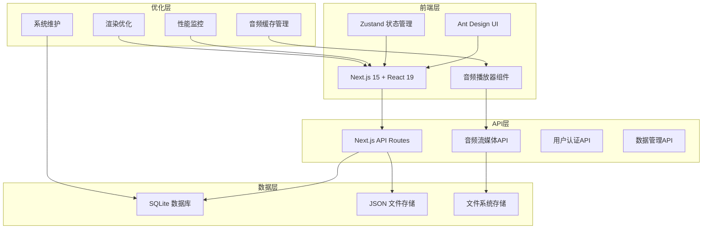
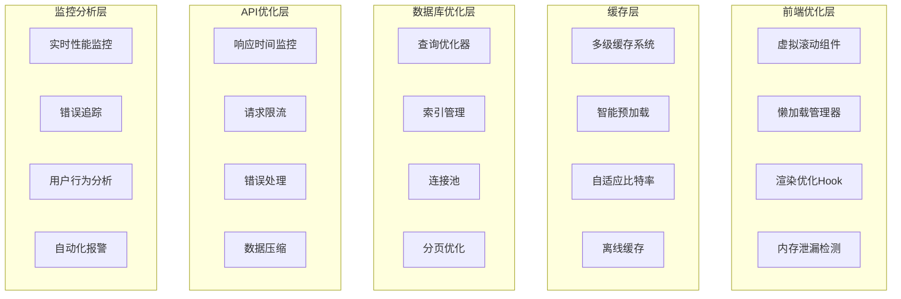

# 项目优化设计文档

## 概述

本设计文档基于健闻局 The Health Hub 项目的现有架构，提供全面的性能优化方案。项目已经具备了基础的优化功能，包括SQLite数据库、音频缓存管理、性能监控和Ant Design UI组件。本设计将在现有基础上进一步优化系统性能、用户体验和稳定性。

## 架构

### 当前架构分析



### 优化后的目标架构



## 组件和接口

### 1. 数据库查询优化组件

#### DatabaseOptimizer 类
```typescript
interface DatabaseOptimizer {
  // 查询优化
  optimizeQuery(query: string, params: any[]): OptimizedQuery;
  
  // 索引管理
  createIndex(table: string, columns: string[]): Promise<void>;
  analyzeQueryPerformance(query: string): QueryAnalysis;
  
  // 连接池管理
  getConnection(): Promise<Database>;
  releaseConnection(connection: Database): void;
  
  // 分页优化
  paginateQuery(query: string, page: number, limit: number): PaginatedResult;
}

interface OptimizedQuery {
  sql: string;
  params: any[];
  estimatedTime: number;
  useIndex: boolean;
}

interface QueryAnalysis {
  executionTime: number;
  rowsScanned: number;
  indexUsed: string[];
  recommendations: string[];
}
```

#### 索引策略
```sql
-- 音频搜索优化索引
CREATE INDEX idx_audios_search ON audios(title, subject, tags);
CREATE INDEX idx_audios_date ON audios(uploadDate DESC);
CREATE INDEX idx_audios_duration ON audios(duration);

-- 用户相关索引
CREATE INDEX idx_users_email ON users(email);
CREATE INDEX idx_users_status ON users(status, role);

-- 评论和评分索引
CREATE INDEX idx_comments_audio ON comments(audioId, createdAt DESC);
CREATE INDEX idx_ratings_audio ON ratings(audioId, rating);

-- 复合索引优化
CREATE INDEX idx_audios_composite ON audios(subject, uploadDate DESC, duration);
```

### 2. 音频流媒体优化组件

#### EnhancedAudioStreamer 类
```typescript
interface EnhancedAudioStreamer {
  // 自适应比特率
  adaptBitrate(networkSpeed: number): AudioQuality;
  
  // 智能预加载
  preloadStrategy(currentAudio: AudioFile, playlist: AudioFile[]): PreloadPlan;
  
  // 缓存管理
  manageCacheSize(maxSize: number): void;
  
  // 断点续传
  resumePlayback(audioId: string, position: number): Promise<void>;
  
  // 网络状态监控
  monitorNetworkQuality(): NetworkQuality;
}

interface AudioQuality {
  bitrate: number;
  sampleRate: number;
  channels: number;
  format: 'mp3' | 'aac' | 'opus';
}

interface PreloadPlan {
  immediate: AudioFile[];  // 立即预加载
  background: AudioFile[]; // 后台预加载
  priority: number[];      // 优先级队列
}

interface NetworkQuality {
  speed: number;           // Mbps
  latency: number;         // ms
  stability: number;       // 0-1
  recommendation: AudioQuality;
}
```

#### 流媒体API优化
```typescript
// 增强的流媒体路由
export async function GET(request: NextRequest, context: { params: { id: string } }) {
  const { id } = context.params;
  const range = request.headers.get('range');
  const quality = request.nextUrl.searchParams.get('quality') || 'auto';
  
  // 自适应质量选择
  const audioQuality = await selectOptimalQuality(quality, request);
  
  // 智能缓存策略
  const cacheKey = `audio_${id}_${audioQuality.bitrate}`;
  const cachedData = await getCachedAudio(cacheKey);
  
  if (cachedData && !range) {
    return serveCachedAudio(cachedData);
  }
  
  // 流式传输优化
  return streamAudioWithOptimization(id, range, audioQuality);
}
```

### 3. 前端渲染优化组件

#### VirtualScrollList 组件
```typescript
interface VirtualScrollListProps<T> {
  items: T[];
  itemHeight: number;
  containerHeight: number;
  renderItem: (item: T, index: number) => React.ReactNode;
  overscan?: number;
  onScroll?: (scrollTop: number) => void;
  loadMore?: () => Promise<void>;
}

const VirtualScrollList = <T,>({
  items,
  itemHeight,
  containerHeight,
  renderItem,
  overscan = 5,
  onScroll,
  loadMore
}: VirtualScrollListProps<T>) => {
  // 虚拟滚动实现
  const [scrollTop, setScrollTop] = useState(0);
  const { visibleItems, totalHeight } = useVirtualization(
    items.length,
    itemHeight,
    containerHeight,
    scrollTop,
    overscan
  );
  
  // 无限滚动
  const { ref, inView } = useInView({
    threshold: 0,
    rootMargin: '100px',
  });
  
  useEffect(() => {
    if (inView && loadMore) {
      loadMore();
    }
  }, [inView, loadMore]);
  
  return (
    <div 
      style={{ height: containerHeight, overflow: 'auto' }}
      onScroll={(e) => {
        const newScrollTop = e.currentTarget.scrollTop;
        setScrollTop(newScrollTop);
        onScroll?.(newScrollTop);
      }}
    >
      <div style={{ height: totalHeight, position: 'relative' }}>
        {visibleItems.map(({ index, offsetY }) => (
          <div
            key={index}
            style={{
              position: 'absolute',
              top: offsetY,
              height: itemHeight,
              width: '100%',
            }}
          >
            {renderItem(items[index], index)}
          </div>
        ))}
        <div ref={ref} style={{ height: 1 }} />
      </div>
    </div>
  );
};
```

#### LazyLoadManager 组件
```typescript
interface LazyLoadManagerProps {
  children: React.ReactNode;
  fallback?: React.ReactNode;
  threshold?: number;
  rootMargin?: string;
  triggerOnce?: boolean;
}

const LazyLoadManager: React.FC<LazyLoadManagerProps> = ({
  children,
  fallback = <div>Loading...</div>,
  threshold = 0.1,
  rootMargin = '50px',
  triggerOnce = true
}) => {
  const [isVisible, setIsVisible] = useState(false);
  const [hasLoaded, setHasLoaded] = useState(false);
  
  const { ref, inView } = useInView({
    threshold,
    rootMargin,
    triggerOnce,
  });
  
  useEffect(() => {
    if (inView && !hasLoaded) {
      setIsVisible(true);
      setHasLoaded(true);
    }
  }, [inView, hasLoaded]);
  
  return (
    <div ref={ref}>
      {isVisible ? children : fallback}
    </div>
  );
};
```

### 4. 缓存策略优化组件

#### MultiLevelCacheManager 类
```typescript
interface MultiLevelCacheManager {
  // L1: 内存缓存 (最快)
  memoryCache: Map<string, CacheItem>;
  
  // L2: IndexedDB缓存 (持久化)
  indexedDBCache: IDBDatabase;
  
  // L3: 服务端缓存 (共享)
  serverCache: RedisLikeCache;
  
  // 缓存操作
  get(key: string): Promise<any>;
  set(key: string, value: any, ttl?: number): Promise<void>;
  invalidate(pattern: string): Promise<void>;
  
  // 缓存策略
  evictLRU(): void;
  preloadCriticalData(): Promise<void>;
  syncCaches(): Promise<void>;
}

interface CacheItem {
  value: any;
  timestamp: number;
  ttl: number;
  accessCount: number;
  lastAccessed: number;
}

// 缓存装饰器
function cached(ttl: number = 300000) { // 5分钟默认TTL
  return function (target: any, propertyName: string, descriptor: PropertyDescriptor) {
    const method = descriptor.value;
    const cacheKey = `${target.constructor.name}_${propertyName}`;
    
    descriptor.value = async function (...args: any[]) {
      const key = `${cacheKey}_${JSON.stringify(args)}`;
      const cached = await cacheManager.get(key);
      
      if (cached) {
        return cached;
      }
      
      const result = await method.apply(this, args);
      await cacheManager.set(key, result, ttl);
      return result;
    };
  };
}
```

### 5. API响应时间优化组件

#### ResponseTimeOptimizer 类
```typescript
interface ResponseTimeOptimizer {
  // 请求监控
  trackRequest(endpoint: string, startTime: number): void;
  
  // 响应压缩
  compressResponse(data: any): Promise<Buffer>;
  
  // 批量请求处理
  batchRequests(requests: APIRequest[]): Promise<APIResponse[]>;
  
  // 请求限流
  rateLimit(clientId: string, endpoint: string): boolean;
  
  // 错误处理
  handleError(error: Error, context: RequestContext): APIResponse;
}

interface APIRequest {
  endpoint: string;
  method: string;
  params: any;
  headers: Record<string, string>;
}

interface APIResponse {
  data: any;
  status: number;
  headers: Record<string, string>;
  timing: {
    total: number;
    database: number;
    processing: number;
  };
}

// API中间件
export function withOptimization(handler: NextApiHandler): NextApiHandler {
  return async (req: NextApiRequest, res: NextApiResponse) => {
    const startTime = performance.now();
    
    try {
      // 请求限流检查
      if (!rateLimiter.check(req)) {
        return res.status(429).json({ error: 'Too Many Requests' });
      }
      
      // 缓存检查
      const cacheKey = generateCacheKey(req);
      const cached = await cache.get(cacheKey);
      if (cached) {
        return res.json(cached);
      }
      
      // 执行原始处理器
      const result = await handler(req, res);
      
      // 缓存结果
      if (res.statusCode === 200) {
        await cache.set(cacheKey, result, 300000); // 5分钟缓存
      }
      
      // 记录性能指标
      const endTime = performance.now();
      performanceMonitor.record(req.url!, endTime - startTime);
      
      return result;
    } catch (error) {
      const endTime = performance.now();
      errorTracker.record(error, {
        endpoint: req.url!,
        duration: endTime - startTime,
        userAgent: req.headers['user-agent'],
      });
      
      throw error;
    }
  };
}
```

## 数据模型

### 优化后的数据库模式

```sql
-- 性能监控表
CREATE TABLE performance_metrics (
  id INTEGER PRIMARY KEY AUTOINCREMENT,
  endpoint TEXT NOT NULL,
  method TEXT NOT NULL,
  response_time INTEGER NOT NULL,
  status_code INTEGER NOT NULL,
  timestamp DATETIME DEFAULT CURRENT_TIMESTAMP,
  user_agent TEXT,
  ip_address TEXT
);

-- 缓存统计表
CREATE TABLE cache_stats (
  id INTEGER PRIMARY KEY AUTOINCREMENT,
  cache_key TEXT NOT NULL,
  hit_count INTEGER DEFAULT 0,
  miss_count INTEGER DEFAULT 0,
  last_accessed DATETIME DEFAULT CURRENT_TIMESTAMP,
  ttl INTEGER,
  size_bytes INTEGER
);

-- 音频播放统计表
CREATE TABLE audio_playback_stats (
  id INTEGER PRIMARY KEY AUTOINCREMENT,
  audio_id TEXT NOT NULL,
  user_id TEXT,
  play_duration INTEGER, -- 播放时长(秒)
  completion_rate REAL,   -- 完成率(0-1)
  quality_level TEXT,     -- 播放质量
  network_speed REAL,     -- 网络速度
  buffer_events INTEGER,  -- 缓冲事件次数
  timestamp DATETIME DEFAULT CURRENT_TIMESTAMP,
  FOREIGN KEY (audio_id) REFERENCES audios(id),
  FOREIGN KEY (user_id) REFERENCES users(id)
);

-- 系统健康检查表
CREATE TABLE system_health (
  id INTEGER PRIMARY KEY AUTOINCREMENT,
  metric_name TEXT NOT NULL,
  metric_value REAL NOT NULL,
  threshold_value REAL,
  status TEXT CHECK(status IN ('healthy', 'warning', 'critical')),
  timestamp DATETIME DEFAULT CURRENT_TIMESTAMP
);
```

### 缓存数据结构

```typescript
interface CacheStructure {
  // 音频元数据缓存
  audioMetadata: {
    [audioId: string]: {
      title: string;
      duration: number;
      coverImage: string;
      tags: string[];
      lastModified: number;
    };
  };
  
  // 用户会话缓存
  userSessions: {
    [sessionId: string]: {
      userId: string;
      preferences: UserPreferences;
      playHistory: string[];
      lastActivity: number;
    };
  };
  
  // 搜索结果缓存
  searchResults: {
    [queryHash: string]: {
      results: AudioFile[];
      totalCount: number;
      timestamp: number;
      ttl: number;
    };
  };
  
  // 系统配置缓存
  systemConfig: {
    [configKey: string]: {
      value: any;
      lastUpdated: number;
      version: number;
    };
  };
}
```

## 错误处理

### 分层错误处理策略

```typescript
// 1. 数据库错误处理
class DatabaseErrorHandler {
  static handle(error: Error, context: DatabaseContext): DatabaseError {
    if (error.message.includes('SQLITE_BUSY')) {
      return new DatabaseError('Database is busy, please retry', 'RETRY', context);
    }
    
    if (error.message.includes('SQLITE_CORRUPT')) {
      return new DatabaseError('Database corruption detected', 'CRITICAL', context);
    }
    
    return new DatabaseError('Unknown database error', 'ERROR', context);
  }
}

// 2. 网络错误处理
class NetworkErrorHandler {
  static handle(error: Error, context: NetworkContext): NetworkError {
    if (error.name === 'TimeoutError') {
      return new NetworkError('Request timeout', 'TIMEOUT', context);
    }
    
    if (error.message.includes('Failed to fetch')) {
      return new NetworkError('Network connection failed', 'CONNECTION', context);
    }
    
    return new NetworkError('Unknown network error', 'ERROR', context);
  }
}

// 3. 音频播放错误处理
class AudioErrorHandler {
  static handle(error: Error, context: AudioContext): AudioError {
    if (error.name === 'NotSupportedError') {
      return new AudioError('Audio format not supported', 'FORMAT', context);
    }
    
    if (error.name === 'NotAllowedError') {
      return new AudioError('Audio playback not allowed', 'PERMISSION', context);
    }
    
    return new AudioError('Audio playback failed', 'PLAYBACK', context);
  }
}

// 4. 全局错误边界
class GlobalErrorBoundary extends React.Component<Props, State> {
  constructor(props: Props) {
    super(props);
    this.state = { hasError: false, error: null };
  }
  
  static getDerivedStateFromError(error: Error): State {
    return { hasError: true, error };
  }
  
  componentDidCatch(error: Error, errorInfo: React.ErrorInfo) {
    // 记录错误到监控系统
    errorTracker.captureException(error, {
      extra: errorInfo,
      tags: { component: 'GlobalErrorBoundary' }
    });
    
    // 发送错误报告
    this.sendErrorReport(error, errorInfo);
  }
  
  private sendErrorReport(error: Error, errorInfo: React.ErrorInfo) {
    // 实现错误报告逻辑
    fetch('/api/errors', {
      method: 'POST',
      headers: { 'Content-Type': 'application/json' },
      body: JSON.stringify({
        error: error.message,
        stack: error.stack,
        componentStack: errorInfo.componentStack,
        timestamp: new Date().toISOString(),
        userAgent: navigator.userAgent,
        url: window.location.href
      })
    });
  }
  
  render() {
    if (this.state.hasError) {
      return <ErrorFallback error={this.state.error} />;
    }
    
    return this.props.children;
  }
}
```

## 测试策略

### 性能测试框架

```typescript
// 1. 数据库性能测试
describe('Database Performance Tests', () => {
  test('Audio search should complete within 500ms', async () => {
    const startTime = performance.now();
    const results = await searchAudios('医学');
    const endTime = performance.now();
    
    expect(endTime - startTime).toBeLessThan(500);
    expect(results.length).toBeGreaterThan(0);
  });
  
  test('User pagination should complete within 200ms', async () => {
    const startTime = performance.now();
    const users = await getUsersPaginated(1, 20);
    const endTime = performance.now();
    
    expect(endTime - startTime).toBeLessThan(200);
    expect(users.data.length).toBeLessThanOrEqual(20);
  });
});

// 2. 音频流媒体测试
describe('Audio Streaming Performance Tests', () => {
  test('Audio stream should start within 2 seconds', async () => {
    const audioElement = new Audio();
    const startTime = performance.now();
    
    audioElement.src = '/api/audio/stream/test-audio-id';
    
    await new Promise((resolve) => {
      audioElement.addEventListener('canplay', resolve);
    });
    
    const endTime = performance.now();
    expect(endTime - startTime).toBeLessThan(2000);
  });
  
  test('Adaptive bitrate should adjust based on network', async () => {
    const networkSpeeds = [1, 5, 10]; // Mbps
    
    for (const speed of networkSpeeds) {
      const quality = adaptiveBitrateManager.getRecommendedQuality(speed);
      expect(quality).toBeDefined();
      expect(quality.bitrate).toBeGreaterThan(0);
    }
  });
});

// 3. 前端渲染性能测试
describe('Frontend Rendering Performance Tests', () => {
  test('Virtual scroll should maintain 60fps', async () => {
    const { container } = render(
      <VirtualScrollList
        items={Array.from({ length: 10000 }, (_, i) => ({ id: i }))}
        itemHeight={50}
        containerHeight={500}
        renderItem={(item) => <div key={item.id}>Item {item.id}</div>}
      />
    );
    
    // 模拟快速滚动
    const scrollContainer = container.firstChild as HTMLElement;
    
    const frameRates: number[] = [];
    let lastTime = performance.now();
    
    for (let i = 0; i < 100; i++) {
      scrollContainer.scrollTop = i * 50;
      
      await new Promise(resolve => requestAnimationFrame(resolve));
      
      const currentTime = performance.now();
      const fps = 1000 / (currentTime - lastTime);
      frameRates.push(fps);
      lastTime = currentTime;
    }
    
    const averageFps = frameRates.reduce((a, b) => a + b) / frameRates.length;
    expect(averageFps).toBeGreaterThan(55); // 允许5fps的误差
  });
});

// 4. 内存泄漏测试
describe('Memory Leak Tests', () => {
  test('Audio player should not leak memory', async () => {
    const initialMemory = (performance as any).memory?.usedJSHeapSize || 0;
    
    // 创建和销毁多个音频播放器实例
    for (let i = 0; i < 100; i++) {
      const { unmount } = render(<AudioPlayer audioId="test" />);
      unmount();
    }
    
    // 强制垃圾回收（如果可用）
    if (global.gc) {
      global.gc();
    }
    
    await new Promise(resolve => setTimeout(resolve, 1000));
    
    const finalMemory = (performance as any).memory?.usedJSHeapSize || 0;
    const memoryIncrease = finalMemory - initialMemory;
    
    // 内存增长应该小于10MB
    expect(memoryIncrease).toBeLessThan(10 * 1024 * 1024);
  });
});
```

### 集成测试

```typescript
// E2E性能测试
describe('End-to-End Performance Tests', () => {
  test('Complete user journey should be performant', async () => {
    const page = await browser.newPage();
    
    // 开始性能监控
    await page.tracing.start({ path: 'trace.json' });
    
    // 1. 页面加载
    const loadStart = Date.now();
    await page.goto('http://localhost:3000');
    await page.waitForSelector('[data-testid="audio-list"]');
    const loadEnd = Date.now();
    
    expect(loadEnd - loadStart).toBeLessThan(3000);
    
    // 2. 搜索功能
    const searchStart = Date.now();
    await page.type('[data-testid="search-input"]', '医学');
    await page.waitForSelector('[data-testid="search-results"]');
    const searchEnd = Date.now();
    
    expect(searchEnd - searchStart).toBeLessThan(1000);
    
    // 3. 音频播放
    const playStart = Date.now();
    await page.click('[data-testid="play-button"]');
    await page.waitForSelector('[data-testid="audio-playing"]');
    const playEnd = Date.now();
    
    expect(playEnd - playStart).toBeLessThan(2000);
    
    // 停止性能监控
    await page.tracing.stop();
    
    // 分析性能指标
    const metrics = await page.metrics();
    expect(metrics.JSHeapUsedSize).toBeLessThan(50 * 1024 * 1024); // 50MB
  });
});
```

这个设计文档提供了全面的优化方案，涵盖了数据库查询、音频流媒体、前端渲染、缓存策略、API响应时间、错误处理和测试策略等各个方面。每个组件都有详细的接口定义和实现策略，确保优化工作能够系统性地进行。