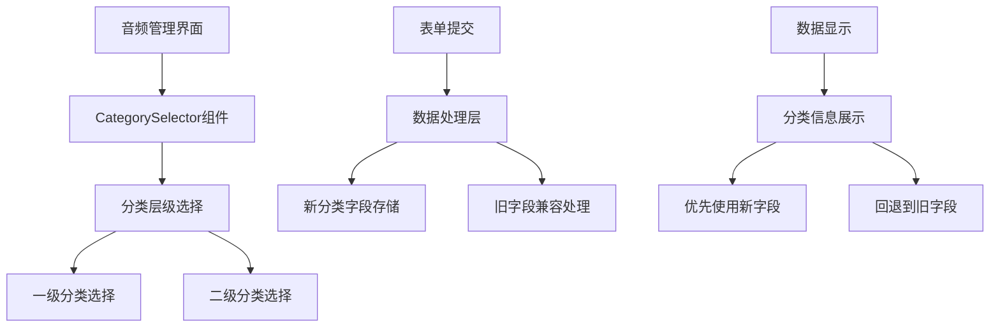

# 删除学科分类兼容模式功能设计文档

## 概览

本设计文档详细说明如何从音频管理界面中删除"学科分类（兼容模式）"功能，同时保持系统的数据兼容性和功能完整性。主要涉及前端UI组件的修改、表单逻辑的简化，以及确保现有数据的正确处理。

## 架构

### 当前架构分析

目前音频管理界面包含两套分类选择机制：
1. **新的层级分类选择器** - 使用 `CategorySelector` 组件，支持一级和二级分类
2. **兼容模式选择器** - 传统的下拉选择框，使用 `subject` 字段

### 目标架构

删除兼容模式后的简化架构：
- 统一使用 `CategorySelector` 组件
- 移除所有兼容模式相关的UI元素
- 保持数据层的向后兼容性



## 组件和接口

### 需要修改的组件

#### 1. 音频管理页面 (`src/app/admin/audio/page.tsx`)

**当前状态：**
```typescript
// 包含兼容模式字段
<Form.Item
  name="subject"
  label="学科分类（兼容模式）"
  tooltip="如果上方的层级分类选择器无法使用，可以使用此备用选项"
>
  <Select placeholder="请选择分类" allowClear showSearch>
    {categories.map(category => (
      <Option key={category.id} value={category.name}>
        {category.name}
      </Option>
    ))}
  </Select>
</Form.Item>
```

**目标状态：**
```typescript
// 完全移除兼容模式字段，只保留CategorySelector
// 无需额外的备用选择器
```

#### 2. 表单数据处理逻辑

**当前逻辑：**
- 同时处理新的 `categoryId`/`subcategoryId` 和旧的 `subject` 字段
- 在表单提交时需要处理两套数据

**目标逻辑：**
- 只处理新的分类字段
- 简化表单验证和数据提交逻辑
- 在数据读取时保持对旧字段的兼容

### 数据处理策略

#### 数据写入策略
```typescript
// 表单提交时的数据处理
const handleFormSubmit = (values: FormValues) => {
  const audioData = {
    ...values,
    // 只使用新的分类字段
    categoryId: categorySelection.categoryId,
    subcategoryId: categorySelection.subcategoryId,
    // 不再处理 subject 字段
  };
  
  // 提交到API
  submitAudioData(audioData);
};
```

#### 数据读取策略
```typescript
// 编辑时的数据回填逻辑
const loadAudioForEdit = (audio: Audio) => {
  // 优先使用新字段
  if (audio.categoryId) {
    setCategorySelection({
      categoryId: audio.categoryId,
      subcategoryId: audio.subcategoryId
    });
  } 
  // 如果只有旧字段，尝试映射到新字段
  else if (audio.subject) {
    const mappedCategory = mapSubjectToCategory(audio.subject);
    if (mappedCategory) {
      setCategorySelection(mappedCategory);
    }
  }
};
```

## 数据模型

### 表单数据模型

**修改前：**
```typescript
interface AudioFormData {
  title: string;
  description?: string;
  subject: string;           // 兼容模式字段
  categoryId?: string;       // 新字段
  subcategoryId?: string;    // 新字段
  // ... 其他字段
}
```

**修改后：**
```typescript
interface AudioFormData {
  title: string;
  description?: string;
  // 移除 subject 字段
  categoryId?: string;       // 主要分类字段
  subcategoryId?: string;    // 子分类字段
  // ... 其他字段
}
```

### 数据库兼容性

数据库层面保持不变，继续支持：
- `subject` 字段（用于现有数据的兼容）
- `categoryId` 和 `subcategoryId` 字段（新的分类系统）

API层面的处理逻辑：
```typescript
// API读取时的兼容处理
const getAudioWithCategory = (audio: AudioRecord) => {
  return {
    ...audio,
    // 显示逻辑：优先使用新字段，回退到旧字段
    displayCategory: audio.categoryId 
      ? getCategoryPath(audio.categoryId, audio.subcategoryId)
      : audio.subject
  };
};
```

## 错误处理

### 分类选择验证

```typescript
// 简化的验证逻辑
const validateCategorySelection = (selection: CategorySelection) => {
  if (!selection.categoryId) {
    throw new Error('请选择分类');
  }
  
  // 如果选择了二级分类，确保一级分类也存在
  if (selection.subcategoryId && !selection.categoryId) {
    throw new Error('选择二级分类时必须先选择一级分类');
  }
};
```

### 数据迁移错误处理

```typescript
// 处理旧数据映射失败的情况
const handleLegacyDataMapping = (audio: Audio) => {
  try {
    if (audio.subject && !audio.categoryId) {
      const mapped = mapSubjectToCategory(audio.subject);
      if (!mapped) {
        // 映射失败时的处理
        console.warn(`无法映射旧分类: ${audio.subject}`);
        // 可以选择设置为默认分类或保持原样
      }
    }
  } catch (error) {
    console.error('分类数据处理错误:', error);
    // 不影响主要功能，只记录错误
  }
};
```

## 测试策略

### 单元测试

1. **组件测试**
   - 验证兼容模式字段已完全移除
   - 验证CategorySelector正常工作
   - 验证表单提交逻辑正确

2. **数据处理测试**
   - 测试新数据的正常处理
   - 测试旧数据的兼容性处理
   - 测试数据映射逻辑

### 集成测试

1. **完整流程测试**
   - 创建新音频的完整流程
   - 编辑现有音频的完整流程
   - 不同类型数据的显示测试

2. **兼容性测试**
   - 只有旧字段的音频编辑
   - 只有新字段的音频编辑
   - 同时有新旧字段的音频处理

### 用户验收测试

1. **界面测试**
   - 确认兼容模式字段不再显示
   - 确认分类选择器正常工作
   - 确认界面简洁性提升

2. **功能测试**
   - 音频创建功能正常
   - 音频编辑功能正常
   - 分类信息显示正确

## 部署和迁移

### 部署步骤

1. **代码部署**
   - 部署前端代码更改
   - 确保API层兼容性处理就位

2. **功能验证**
   - 验证新功能正常工作
   - 验证现有数据正确显示
   - 验证没有功能回归

3. **监控和回滚准备**
   - 监控错误日志
   - 准备快速回滚方案
   - 用户反馈收集

### 风险缓解

1. **数据风险**
   - 保持数据库字段不变
   - API层提供兼容性处理
   - 不删除任何现有数据

2. **功能风险**
   - 渐进式部署
   - 充分的测试覆盖
   - 快速回滚能力

3. **用户体验风险**
   - 提供用户指导
   - 监控用户反馈
   - 及时处理问题

## 性能考虑

### 前端性能

- 移除不必要的组件减少渲染负担
- 简化表单逻辑提升响应速度
- 减少代码体积

### 后端性能

- 简化数据处理逻辑
- 减少不必要的字段处理
- 保持查询性能不变

## 安全考虑

### 数据验证

- 确保分类选择的有效性
- 防止无效分类ID的提交
- 保持现有的权限控制

### 输入安全

- 验证分类选择的合法性
- 防止恶意数据注入
- 保持现有的安全措施